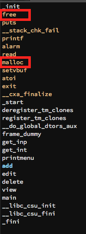

A x64 binary file:

data_bank: ELF 64-bit LSB shared object, x86-64, version 1 (SYSV), dynamically linked, interpreter /lib64/ld-linux-x86-64.so.2, for GNU/Linux 3.2.0, BuildID[sha1]=9fce7c0551b4394096ca7820417815132c8f029c, not stripped

The binary is almost fully protected, only missing Fortify:

So it is not possible to use gadgets without leaking due to the PIE and neither overwrite the GOT entries because of the Full RelRo.

Disassembling the binary it can be noted not many functions but malloc() and free() which indicates that could be a heap exploitation challenge.

Utilizing a double-free vulnerability it is possible to corrupt a chunk and leak the libc address after freeing 8 times:

Now we can use the view() function to leak a libc address from the chunk.

After leaking, it is now time for the exploitation, it is possible to use the tcache poisoning attack and overwrite __free_hook for the magic gadget.

It was provided a libc, so it can be calculated a magic gadget and the offset to __free_hook.

root@mphx2-VM:/home/mphx2/ctfs/bsidesdelhi# readelf -s libc.so.6 | grep free_hook
   221: 00000000003ed8e8     8 OBJECT  WEAK   DEFAULT   35 __free_hook@@GLIBC_2.2.5

Then use free() with the delete() function and the shell pops up.
