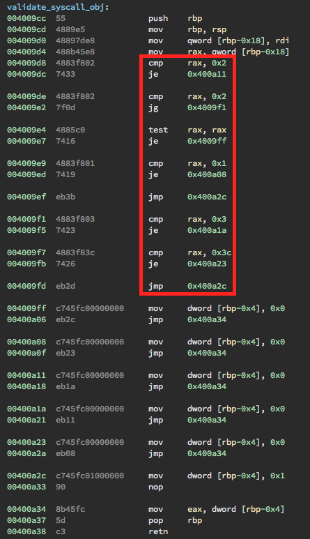
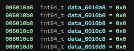

A x64 binary file:

easypeasy: ELF 64-bit LSB executable, x86-64, version 1 (SYSV), dynamically linked, interpreter /lib64/ld-linux-x86-64.so.2, 
for GNU/Linux 2.6.32, BuildID[sha1]=174509cedf6f9aa8ba5dca623f0a3ac6c32ee558, not stripped

The binary asks for 7 values for the registers in loop: 

These registers are used to be executed by the syscall implemented on exec_syscall_obj(). 

However, only few syscalls are available, those are been filtered by the function validate_syscall_obj().
Only, open(0x2)/read(0x0)/write(0x1)/close(0x3)/exit(0x3c).

Now it is needed to set the values to open/read/write the flag from the file /home/easypeasy/flag, indicated on the challenge description.

Since there is no PIE, we can write data on the file and re-utilize for our execution. The application is saving each data 
from the registers on .data.

To be able to write the full path (/////home/easypeasy/flag) it was used three registers RCX, R8 and R9 for this matter since it won't be utilized for this exploitation. The address 0x601500 (.data) was used for saving the data from the flag file.

