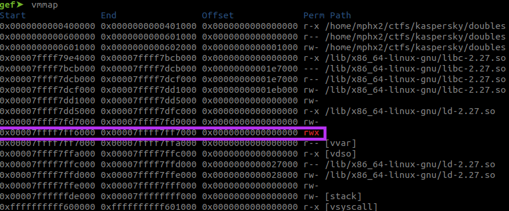
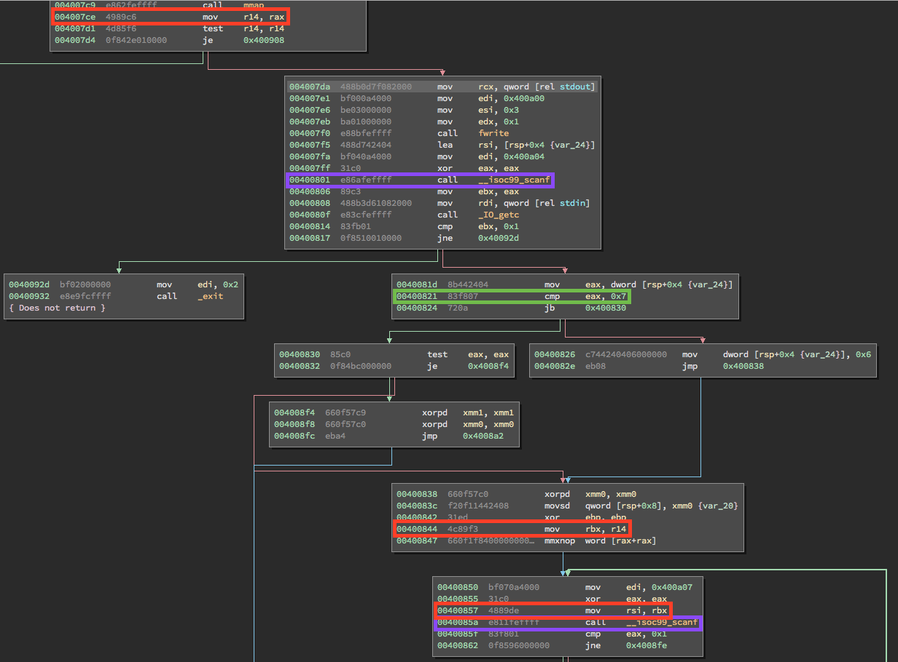
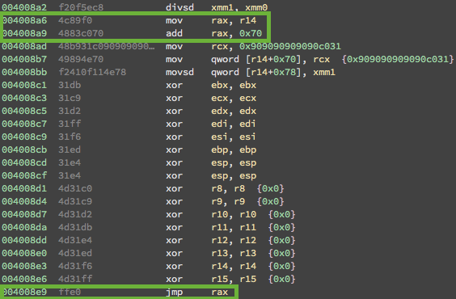
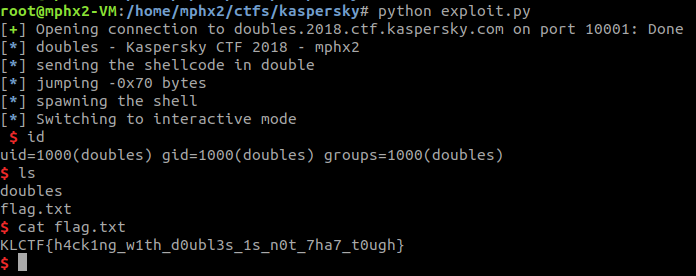

It is a x64 ELF file:

doubles: ELF 64-bit LSB executable, x86-64, version 1 (SYSV), dynamically linked, interpreter /lib64/ld-linux-x86-64.so.2, for GNU/Linux 3.2.0, BuildID[sha1]=e5511e0c31ccc63eda7398cbbfdf1d479f4854cd, not stripped

The binary protections:

Canary                        : No

NX                            : Yes

PIE                           : No

Fortify                       : No

RelRO                         : Partial

The binary only have the NX enabled. So no execution on memory allocations including stack.

However on the static analysis it is possible to determine that a new memory allocation is being done with mmap() on 0x4007c9.

The allocation is done randomly on memory, with 0x10000 bytes and with execution permission.

Here part of the disassembled binary:

The address of the allocated memory by mmap() is saved on $r14 to use during the execution. And then proceeding the execution, there is the first scanf() at 0x40081. This will read an unsigned integer from the user's input.

This will determine how many double words you want to write on the allocated memory at the address 0x40085a, another scanf().

And then the registers are zeroed, but RAX with the allocated memory+0x70 bytes and it finally jumps there where it contains the last doubles from the input.

So it will have the shellcode submitted in double (up to 0x6 times) and the $rip will be 0x70 bytes from this.

It is necessary to reach the entire shellcode jumping -0x78 bytes from the execution (there is some thrash 0x909090909090c031) put by the execution on offset 0x70.

There are opcode bytes that does the jump for short distances, for -0x78 bytes are *\xeb\x86*.

All registers were zeroed including $esp and $ebp ($rsp/$rbp) during the last block of execution. My tactic was to use $rip as reference for constructing since it was the only address available.

#   0x7ffff7ff6000:	lea    rdi,[rip+0x19]        # Copying the address from $rip+0x19 where it contains the /bin/sh%00

#   0x7ffff7ff6007:	nop

#   0x7ffff7ff6008:	lea    rbx,[rdi]             # Copying the address from $rdi to $rbx

#   0x7ffff7ff600b:	lea    rsp,[rdi]             # Copying the address from $rdi to $rsp

#   0x7ffff7ff600e:	nop

#   0x7ffff7ff600f:	nop

#   0x7ffff7ff6010:	mov    rax,0x3b               # Setting $rax to 0x3b, execve syscall

#   0x7ffff7ff6017:	nop

#   0x7ffff7ff6018:	syscall                       # syscall

And executing the exploit.

Link to the [exploit!](exploit.py)
