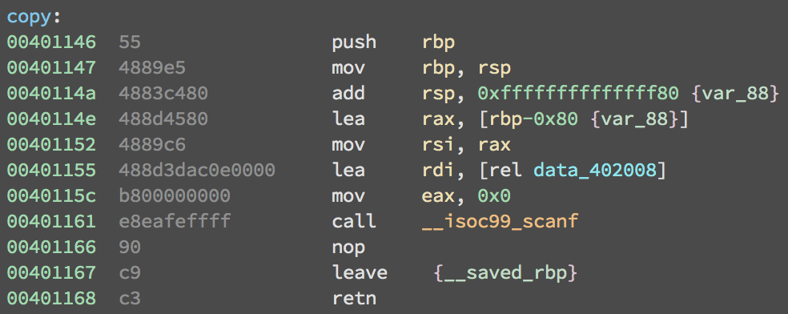

A x64 binary file:

babypwn: ELF 64-bit LSB executable, x86-64, version 1 (SYSV), dynamically linked, interpreter /lib64/ld-linux-x86-64.so.2, for GNU/Linux 3.2.0, BuildID[sha1]=aceea8523337cd304e3835a461e68c809d12fc01, not stripped

ELF protections:

So there's no canary, no PIE, no Fortify and partil RelRo.

There's the function copy() that will allow to save data on the stack with no boundries using scanf() and will cause a stack-based buffer overflow vulnerability. Since there's no canary, it's possible to overwrite RIP and get $PC.

The challenge provided the libc but since ASLR is enabled, we need to leak an address from the there for being able to calculate base address and any other function from the library.

In this case, it's possible to utilize the function puts() to leak any GOT entry, including puts itself. It is possible to use the utility "ropper" to dump useful gadgets from the binary.

So the ROP will be:

pop_rdi; ret = 0x401203

puts_got     = 0x403fc8

puts_plt     = 0x401030

This will leak the puts@LIBC address and we can calculate any other function address based on that, in this case system().

We need to re-run the application for being able to execute functions again. At first, I tried to use main()=0x401169 but system() could not being executed mostly because the stack/registers were already populated. In the end, It was possible to re-run the scanf() using the function copy()=0x401146 from the binary and use system()+27 for executing /bin/sh.

So the first rop:

pop_rdi; ret = 0x401203

puts_got     = 0x403fc8

puts_plt     = 0x401030

copy         = 0x401146

The /bin/sh address is on the binary at 0x40302d but could be calculated from the libc too.

And then the second rop:

pop_rdi; ret = 0x401203

bin_sh       = 0x40302d

system       = system@LIBC+27

And shell!

