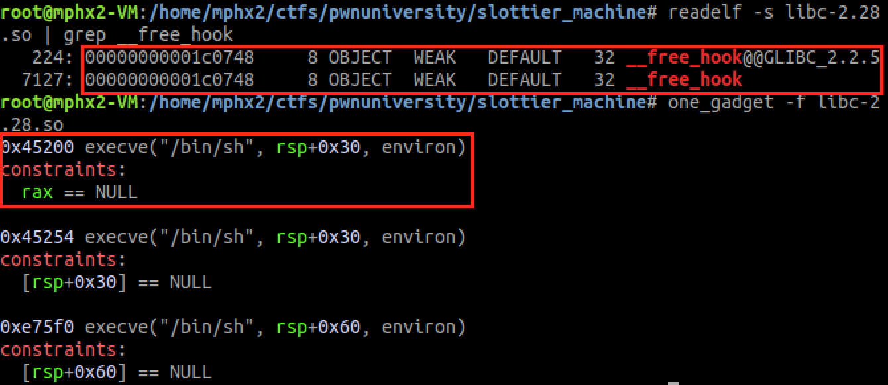
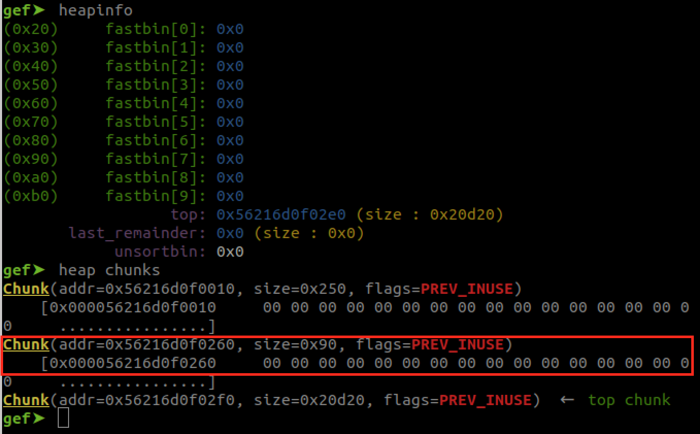
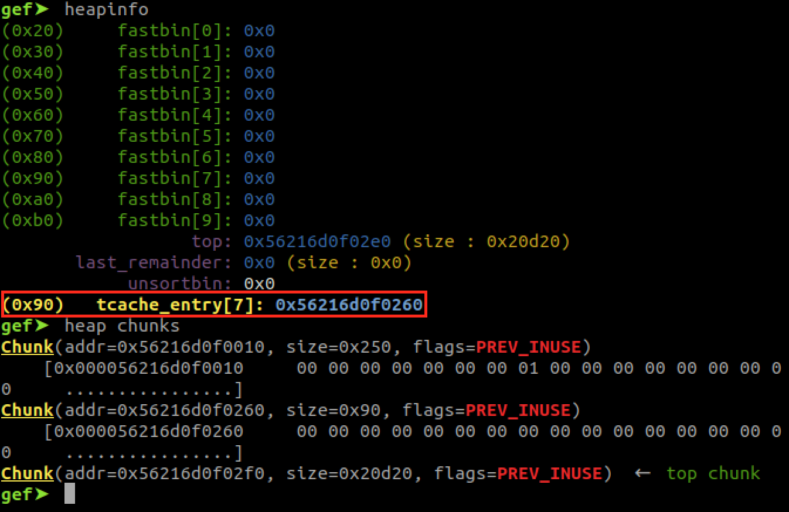
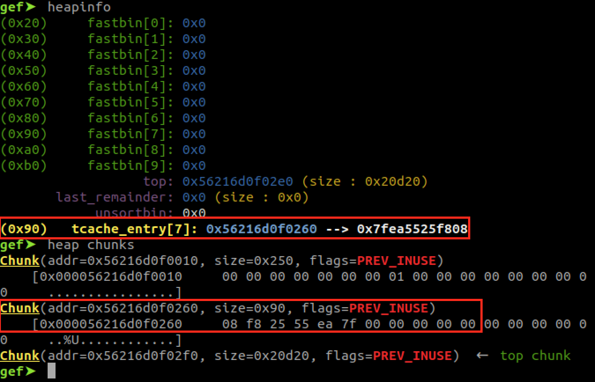
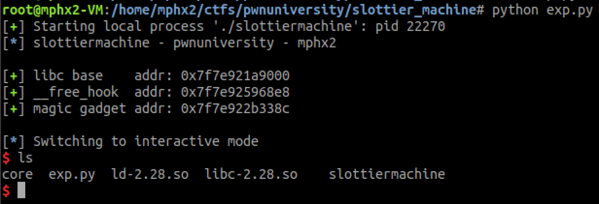

It's a x64 binary file:

**slottiermachine: ELF 64-bit LSB shared object, x86-64, version 1 (SYSV), dynamically linked, interpreter /lib64/ld-linux-x86-64.so.2, for GNU/Linux 3.2.0, BuildID[sha1]=9c102a48d0082f6109f20a8015bb9eab04c82e8c, not stripped**

The binary protections:

So we can't use binary gadgets without a leak (PIE) but we can overwrite GOT entries (partial RelRo).

The application already leaks the system() address.

You have 7 coins for creating(malloc)/deleting(free) and editing using read().

I utilized the tcache dup + poisoning technique and a magic_gadget from libc to exploit this locally.

Steps:

0 - Retrieved leaked system() addr and calculate libc base, __free_hook and magic gadget addresses.

1 - malloc(128)

2 - free() -- tcache dup

3 - Write on the chunk with the __free_hook address using the function [3] on the application.

4 - malloc(128)

5 - malloc(128) -- tcache poisoned

6 - Write the magic gadget address on the chunk that will overwrite the __free_hook function with the magic gadget address.

7 - free() -- that will trigger the overwritten __free_hook = > magic gadget and shell!

