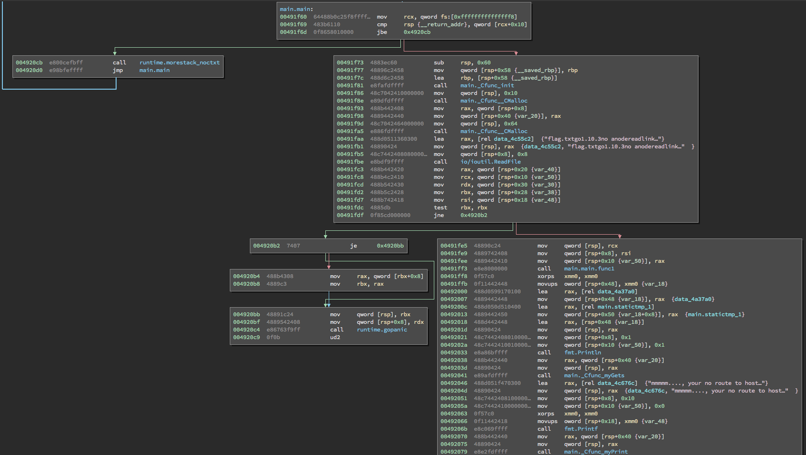

A x64 ELF file:

**pwn3: ELF 64-bit LSB executable, x86-64, version 1 (SYSV), dynamically linked, interpreter /lib64/ld-linux-x86-64.so.2, for GNU/Linux 3.2.0, BuildID[sha1]=7bf36f31cd9a2014bad5fb119d30119e3ea0cad9, not stripped**

Binary protections:

gef➤  checksec

[+] checksec for '/home/mphx2/ctfs/ritsec/pwn3'

Canary                        : No

NX                            : Yes

PIE                           : No

Fortify                       : No

RelRO                         : Partial

gef➤ 

The application was developed in GO, so the static analysis is a little bit tricky. Many imported/unused functions. But the important thing happens at main.main().

The application reads the flag from the file (flag.txt) at 0x491fbe. At 0x492041, the implemented gets() is used to get the input from the user and then print on the screen at 0x492079.

During the dynamic analysis, I did a breakpoint on the function at 0x492079 and was able to see that the data from the flag and the input were close, only 0x90 bytes. 

So we can overwrite the memory from our input to the flag and the binary will print the flag if there's no end char (/x00/xa0) during the printing.

Testing locally:

On the remote host, it was needed to run multiple times:

