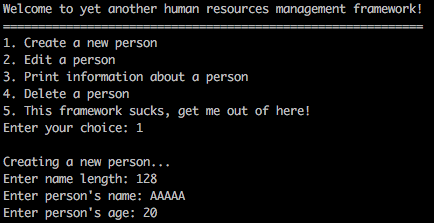
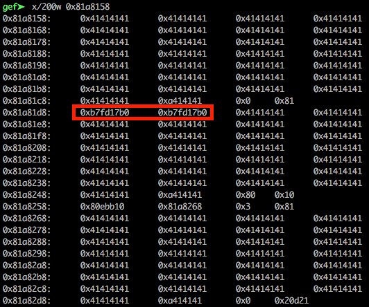
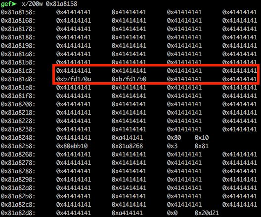
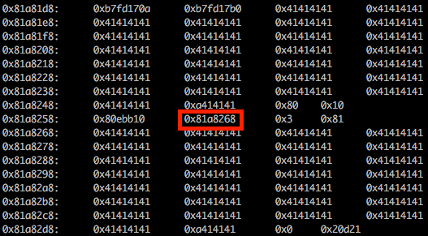
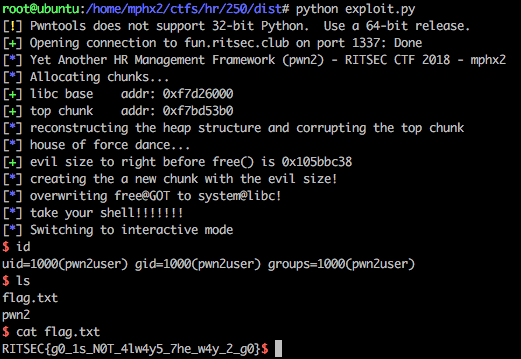

A x32 ELF file:

**pwn2: ELF 32-bit LSB executable, Intel 80386, version 1 (SYSV), dynamically linked, interpreter /lib/ld-linux.so.2, for GNU/Linux 2.6.32, BuildID[sha1]=8683cf78a615c5820aef885b4612b71806a77b00, not stripped**

The binary protections:

gef➤  checksec

[+] checksec for '/home/mphx2/ctfs/hr/250/dist/pwn2'

Canary                        : Yes

NX                            : Yes

PIE                           : No

Fortify                       : Yes

RelRO                         : Partial

gef➤

The application is developed in GO, so the static analysis is a little bit tricky.

The binary has five options create/edit/print/delete a person and exit. There are no boundries on the application, it is possible to overflow any chunk, edit deleted chunks, etc. 

For leaking the libc, it was created three chunks, deleted the second one and edited the first chunk with bytes overwriting until the libc addresses on the second chunk.

At this point, it was deleted the second chunk (ID=1):

Now the first chunk (ID=0) is edited to overwrite all the null chars to the libc addresses. In this case the original first chunk was 120 bytes and now will be 129 bytes (one extra for \x0a) and filled with 128 bytes.

Printing the first chunk and leaking the libc address:

It's important to restore the chunks structure as the same it was when deleted the second chunk. Editing the first chunk and setting the bytes as they were.

**"A"*120+p32(0x0)+p32(0x91)**

Now, it's used the same technique to leak the heap address on the third chunk, overflowing the second chunk.

At this point, we have all addresses needed for an attack. In this case, I utilized the "House of Force" technique, where the top chunk is corrupted to a negative number allowing to create a big chunk without calling mmap() that will overlap until the address you want to overwrite.

While reconstructing the state from the chunks, it was set the top chunk as **0xffffffff**. It also includes the future argument for system() after free@GOT gets overwritten.

"A"*120+p32(0x0)+p32(0x91)+"E"*140+p32(0x11)+***p32(bin_sh)****2+p32(0x0)+p32(0xa9)+"F"*160+p32(0x0)+***p32(0xffffffff)***

Full write-up later.

